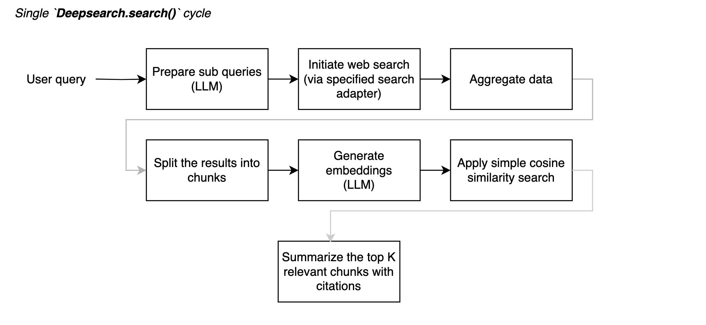

# deepsearch-rb

A ruby gem for performing LLM-powered automated web search.
The only runtime dependencies are [ruby_llm](https://github.com/crmne/ruby_llm?tab=readme-ov-file) and [async](https://github.com/socketry/async).



<details>
<summary>🎥 A simple demo within a sinatra app demonstrating the basic 1-cycle flow. (`examples/simple_webapp`) ▶️</summary>


</details>

---

**NOTE**: You can also implement your own chains in the way it works for you, BFS/DFS search on any topic.
See the draft implementation of multi-chain flow in `examples/multi-step-chain/script.rb`

## Installation

[](https://github.com/alexshagov/deepsearch-rb/actions/workflows/ruby.yml)

### Quick installation via nix flakes

If you're using nix flakes, just run `nix develop` and you'll enter a fully prepared dev environment.

Otherwise, make sure you have installed `required_ruby_version` = ">= 3.2.0".

```ruby
# Gemfile
gem 'deepsearch-rb'
# ..

bundle install
```

Or install from a local folder:
```bash
gem 'deepsearch-rb', path: '<path_to_gem>'
```

## Examples

See the the `examples/` folder for a simple test as well as mini sinatra
application streaming gem events via websocket interface. 

## Configuration Options

### Minimal config

- The LLM configuration is fully based on [ruby_llm](https://github.com/crmne/ruby_llm?tab=readme-ov-file) gem.
- There are two built-in search adapters you can use out of the box:
  - [tavily](http://tavily.com/)
  - [serper](http://serper.dev/playground)

```ruby
Deepsearch.configure do |config|
  config.search_adapter = :tavily  # or :serper, :mock
  config.tavily_api_key = "your_tavily_api_key"
  config.serper_api_key = "your_serper_api_key"
  
  # LLM configuration (all config options are coming from `ruby_llm` gem),
  # you can experiment with any model you like
  config.ruby_llm.gemini_api_key = ENV['GEMINI_API_KEY']
  config.ruby_llm.default_model = 'gemini-2.0-flash-lite'
  config.ruby_llm.default_embedding_model = 'text-embedding-004'
  # ..
end
```

### Advanced config

#### Specifying your own search adapter

```ruby
class MyCustomAdapter
  def initializeт;end

  def search(query, options = {})
    # Implement your search logic here
    {
      "results" => [
        { "url" => "https://example.com/result1", "content" => "Content 1 from custom search" }
      ]
    }
  end
end

Deepsearch.configure { |config| config.custom_search_adapter_class = MyCustomAdapter }
```

#### Specifying your own prompts

See the `Deepsearch::PromptsConfig` interface to learn what methods and arguments are expected.

```ruby
class MyPromptsConfig < Deepsearch::PromptsConfig
  def subquery_prompt(query:)
    <<~PROMPT
      You are a search expert. Given this query: "#{query}",
      generate 3 alternative search queries that would help find more information.
      Return them as a simple list, one per line.
    PROMPT
  end

  # Override other prompt methods as needed
end

Deepsearch.configure { |config| config.prompts_config = MyPromptsConfig.new }
```

#### Specifying event listener

```ruby
class MyListener
  def on_deepsearch_event(event, step:, result:)
    puts "Event: #{event}, Step: #{step}, Success: #{result.success?}"
  end
end

Deepsearch.configure { |c| c.listener = MyListener.new }
```

#### Specifying max total search results

```ruby
result = Deepsearch.search("Ruby 3 unknown features", max_total_search_results: 25)
```

# License

The gem is available as open source under the terms of the [MIT License](https://opensource.org/licenses/MIT).
